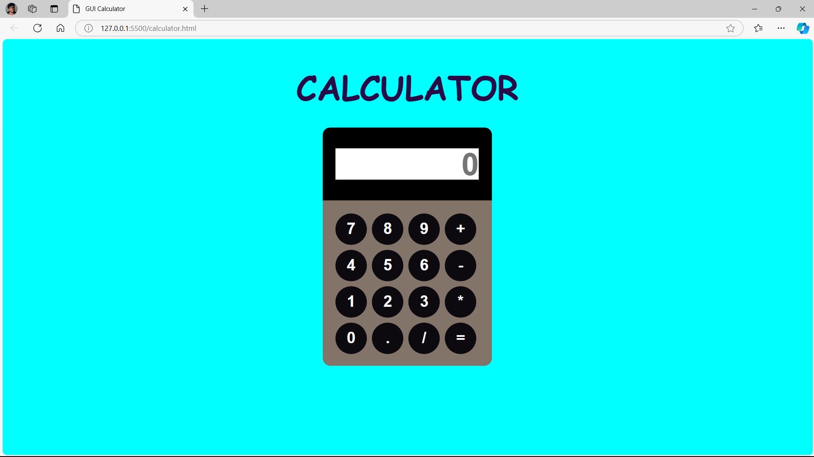
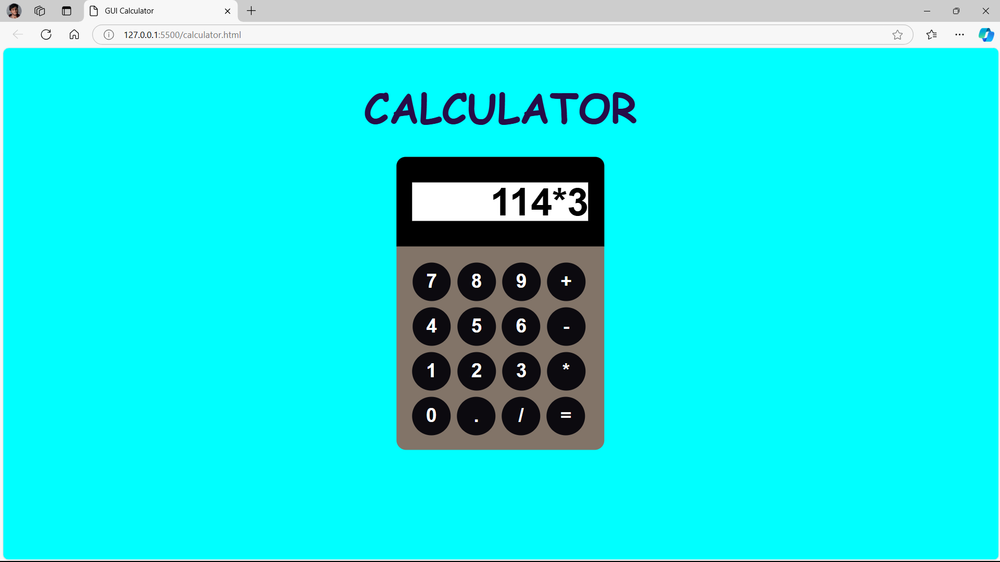
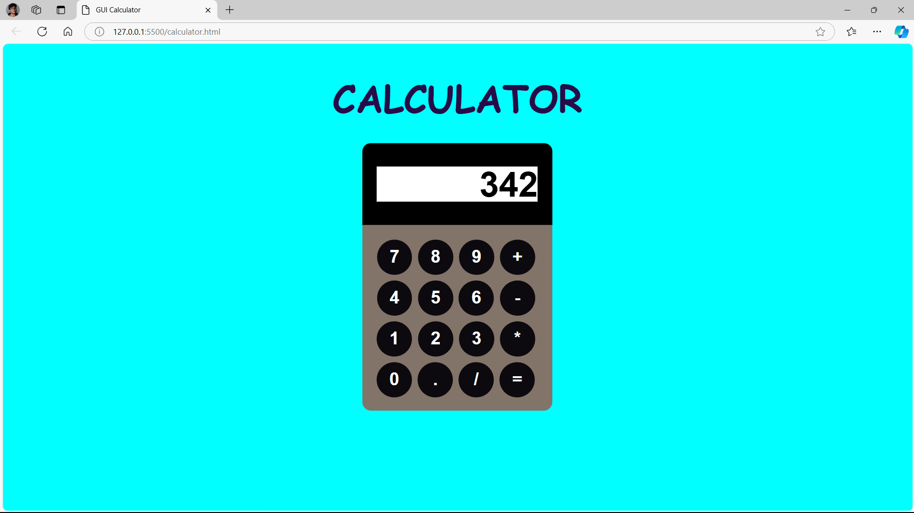

# Calculator
A simple calculator project in HTML involves creating a basic calculator that performs mathematical operations such as addition, subtraction, multiplication, and division.

# Screenshots
## Calculator View

## Calculating

## Result

# Description
This includes the display area (where the numbers and results are shown) and the buttons for the digits, operations, and an equal sign (=) to perform the calculations.

# Add Calculator Functionality (JavaScript)
To make the calculator work, you will need to write JavaScript to handle the button clicks, perform the calculations, and display the result.

# Running the Calculator
Create two files: calculator.html, calculator.css.

Add the HTML structure in calculator.html, style in calculator.css, and the functionality of javasript within same calculator.html file.

Open the calculator.html file in a browser, and you’ll have a fully functional basic calculator!